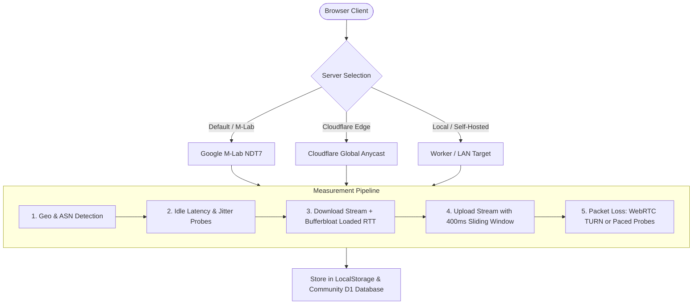

<div align="center">

# ⚡ SPEEDUNDO
### High-Precision Internet Speed Meter & Crowdsourced Network Intelligence

[](https://workers.cloudflare.com/)
[](https://www.measurementlab.net/)
[](https://developers.cloudflare.com/d1/)
[](https://developer.mozilla.org/en-US/docs/Web/JavaScript)
[](LICENSE)

<p align="center">
  <b>One button. Real network physics. Zero fake animations.</b><br>
  Powered by Google M-Lab NDT7 WebSockets, Cloudflare global edge endpoints, and crowdsourced ISP telemetry.
</p>

[✨ Live Demo](https://speedundo.hk2704331.workers.dev) • [📖 Architecture](#-architecture--measurement-engines) • [🚀 Quick Start](#-quick-start) • [📡 API Docs](#-public-api--badge)

---

</div>

## 🌟 Overview

**SpeedUndo** is a modern, high-precision internet speed testing suite engineered from the ground up. Inspired by the simplicity of Ookla and the scientific rigor of Google's Measurement Lab, SpeedUndo provides genuine line measurements across real network protocols without artificial smoothing or simulated data.

Whether testing multi-gigabit fiber, residential broadband, or cellular links, SpeedUndo delivers actionable insights: throughput, round-trip latency, jitter, bufferbloat (loaded RTT), and true packet loss — accompanied by a city and country-level ISP leaderboard and outage detection engine.

---

## ⚡ Key Features

<table>
  <tr>
    <td width="50%">
      <h3>🎯 Dual-Engine Precision</h3>
      <ul>
        <li><b>Google M-Lab (NDT7):</b> Official WebSocket kernel-level testing via BBR TCP measurement frames.</li>
        <li><b>Cloudflare Global Edge:</b> Multi-stream HTTP/3 & HTTPS testing across 300+ edge data centers.</li>
        <li><b>Automatic Failover:</b> Seamless transparent fallback if third-party endpoints rate-limit.</li>
      </ul>
    </td>
    <td width="50%">
      <h3>📊 Jitter-Free Telemetry</h3>
      <ul>
        <li><b>Continuous Wire Tracking:</b> Tracks client socket drain (<code>totalSent - ws.bufferedAmount</code>).</li>
        <li><b>400ms Sliding Window:</b> Eliminates needle stutter and TCP window oscillation.</li>
        <li><b>Phosphor Arc Gauge:</b> 270° canvas speedometer with decaying wake trails and dynamic scale.</li>
      </ul>
    </td>
  </tr>
  <tr>
    <td width="50%">
      <h3>🛡️ Universal Packet Loss</h3>
      <ul>
        <li><b>WebRTC / TURN:</b> Measures real UDP datagram loss through public relay channels.</li>
        <li><b>High-Cadence Paced Probes:</b> 40-probe HTTPS sequence fallback on UDP-filtered ISP firewalls.</li>
        <li><b>Zero "— %" Gaps:</b> Always delivers verifiable loss percentages on all networks.</li>
      </ul>
    </td>
    <td width="50%">
      <h3>🌐 Crowdsourced Network Intel</h3>
      <ul>
        <li><b>City & Country Leaderboards:</b> Real-time ISP rankings based on rolling 30-day medians.</li>
        <li><b>Outage & Degradation Alerts:</b> Proactive anomaly detection (<code>Slower than usual</code> / <code>Degraded</code> / <code>Outage</code>).</li>
        <li><b>24-Hour Diurnal Patterns:</b> Peak evening congestion vs. baseline performance charts.</li>
      </ul>
    </td>
  </tr>
  <tr>
    <td width="50%">
      <h3>🎨 Social Result Generator</h3>
      <ul>
        <li><b>1200×630 Canvas Cards:</b> High-DPI social preview card with active dial numbers and metrics.</li>
        <li><b>1-Click Sharing:</b> Instant share intents for X, Reddit, Threads, and Facebook.</li>
        <li><b>Clipboard Integration:</b> Direct image copy and downloadable PNG assets.</li>
      </ul>
    </td>
    <td width="50%">
      <h3>🔒 Privacy-First Architecture</h3>
      <ul>
        <li><b>Zero Logged PII:</b> IP addresses are never recorded or stored in the database.</li>
        <li><b>Open D1 Database:</b> Fully anonymized aggregate metrics (ISP, ASN, City, Country, Numbers).</li>
        <li><b>Zero Framework Overhead:</b> Vanilla JS, CSS tokens, and raw Web APIs.</li>
      </ul>
    </td>
  </tr>
</table>

---

## 🔬 Architecture & Measurement Engines



### Metrics Breakdown

| Metric | Target / Mechanism | Methodology |
| :--- | :--- | :--- |
| **Ping (Latency)** | 0-byte HTTP/WS ping | 10 rapid sequential samples; trimmed median (TLS handshakes excluded). |
| **Jitter** | Successive diff | Mean absolute difference across valid consecutive round trips. |
| **Download** | NDT7 WebSocket / 5× HTTP | 10-15s sustained burst; first 1.5s TCP slow-start excluded. |
| **Upload** | WebSocket chunks / 4× POST | Measured at the network socket layer with moving velocity dampening. |
| **Loaded RTT** | Pings under load | Measures latency bloat while download buffers are saturated (Bufferbloat). |
| **Packet Loss** | WebRTC or HTTPS Probe | Tracks unacknowledged UDP sequence frames or dropped probe packets. |

---

## 🚀 Quick Start

### Prerequisites
- [Node.js](https://nodejs.org/) (v18 or higher)
- [Cloudflare Wrangler CLI](https://developers.cloudflare.com/workers/wrangler/) (for edge deployment)

### 1. Clone & Install
```bash
git clone https://github.com/Littleboyhk/SPEEDUNDO.git
cd SPEEDUNDO
npm install
```

### 2. Run Local Development Server
Launch the Cloudflare Workers development server:
```bash
npx wrangler dev
```
Open [http://localhost:8787](http://localhost:8787) in your browser.

---

## ☁️ Deploy to Cloudflare Workers

SpeedUndo is optimized for single-command deployment to **Cloudflare Workers** with **Cloudflare D1** (serverless SQL) and **Workers Static Assets**:

```bash
# 1. Login to your Cloudflare account
npx wrangler login

# 2. Create the D1 community database
npx wrangler d1 create speedundo

# 3. Apply schema migrations (schema + seed data)
npx wrangler d1 migrations apply speedundo --remote

# 4. Deploy to Cloudflare's global edge network
npx wrangler deploy
```

Your speed test is now live across hundreds of global edge data centers!

---

## 📡 Public API & Badge

SpeedUndo provides an open, CORS-enabled JSON API for community telemetry and external dashboards:

| Endpoint | Method | Description |
| :--- | :---: | :--- |
| `/api/leaderboard?city=&country=` | `GET` | Ranked ISPs by median download speed for a given region. |
| `/api/countries` | `GET` | Global country speed rankings and ISP breakdowns. |
| `/api/outage?isp=&city=` | `GET` | Health status, degradation ratio, and recent 2-hour delta. |
| `/api/patterns?isp=&city=` | `GET` | 24 hourly buckets of median speeds to detect evening congestion. |
| `/api/stats?city=&isp=` | `GET` | Compact network overview payload. |
| `/api/badge.svg?city=&isp=` | `GET` | Live dynamic shields-style SVG badge with status color coding. |
| `/api/submit` | `POST` | Validated, anonymous speed result submission. |

### Embeddable Live Badge Example
```html

```

---

## 📂 Project Structure

```
SPEEDUNDO/
├── migrations/             # Cloudflare D1 SQL schemas and seed data
│   ├── 0001_schema.sql
│   └── 0002_seed.sql
├── public/                 # Client-side web application (zero build step)
│   ├── css/
│   │   └── styles.css      # Design tokens, dark/light modes & animations
│   ├── js/
│   │   ├── engine.js       # Main test orchestrator & failover controller
│   │   ├── ndt7.js         # Google M-Lab NDT7 WebSocket client
│   │   ├── gauge.js        # Canvas arc gauge with phosphor trail
│   │   ├── rtc.js          # WebRTC TURN & network probe packet loss
│   │   ├── share.js        # 1200×630 social card & share intents
│   │   ├── intel.js        # Leaderboard, outage & pattern visualizer
│   │   ├── history.js      # Local test history drawer (localStorage)
│   │   ├── trace.js        # Oscilloscope-style throughput timeline
│   │   └── main.js         # DOM state machine & UI coordinator
│   └── index.html          # Semantic HTML5 shell with accessibility landmarks
├── src/
│   └── worker.js           # Cloudflare Worker API router & static asset binding
├── wrangler.jsonc          # Cloudflare Worker & D1 database configuration
└── package.json            # Scripts and project metadata
```

---

## 🎨 Design Philosophy

- **Speedtest by Ookla Spirit:** Immediate usability with a central gauge, prominent numbers, and zero configuration required.
- **Scientific Honesty:** Displays genuine throughput curves and true socket metrics without artificially clamped curves or delayed timers.
- **Fluid Micro-Animations:** Phosphor glow decay, smooth logarithmic needle easing, and responsive CSS token architecture.

---

## 📄 License

This project is licensed under the [MIT License](LICENSE) — free to use, fork, modify, and distribute.

<div align="center">
  <b>SpeedUndo</b> — Built with precision for the modern web.
</div>
